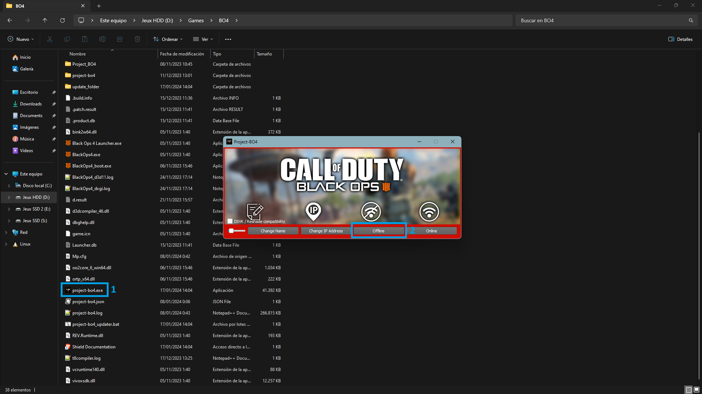

# Radmin VPN Guide

## Playing With Radmin VPN.

#### Host Pc&#x20;

(This is the pc thats hosting the server.

Download Radmin vpn [here.](https://www.radmin-vpn.com/)

Install Radmin VPN on the local computer.

Create network: Press "Create network" button. Set Network name and Password.

<figure><figcaption></figcaption></figure>

In the Project bo4 `Launcher` connect the host pc to `127.0.0.1`  [connecting-to-a-server.md](../launcher-guide/connecting-to-a-server.md "mention")

#### Remote Pc

(This will be your friends pc)

Download radmin vpn [here.](https://www.radmin-vpn.com/)

Install Radmin VPN on the remote computer.

Launch the software and press "Join network" button. Enter the network name and password that your friend set when creating his network.

<figure><figcaption></figcaption></figure>

In the Project bo4 `Launcher` connect the remote pc to the host ip address displayed in radmin.
